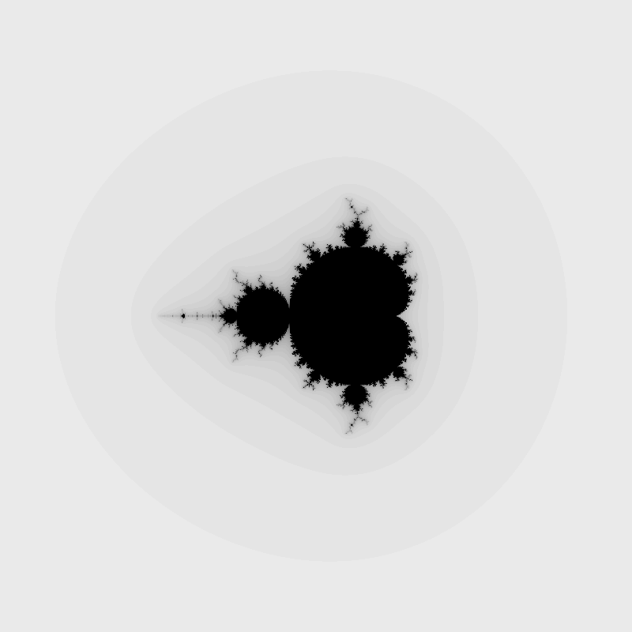
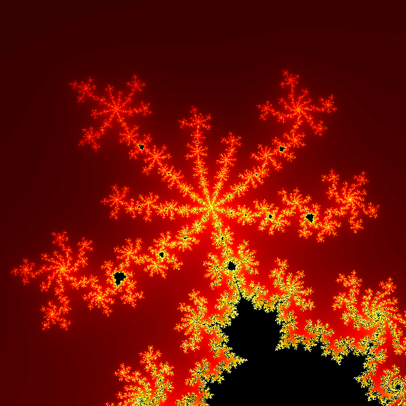

# Mandelbrot Generator

## Setup

This project relies on the following programs and libraries:
- [CMake](https://cmake.org)
- [libpng](http://libpng.org/pub/png/libpng.html)

Compiling the source code:
```
$ cmake CMakeLists.txt
$ make
```
If you wish to see verbose debug output, you can use `cmake -DCMAKE_BUILD_TYPE=Debug CMakeLists.txt` instead.
## Usage

```
Usage: mandelbrot-generator -d depth -f output_file -i image_size -l limit -p plane_specs [-P palette_file]
    depth         Number of iterations per pixel.
    output_file   Path of the resulting PNG file.
    image_size    Size of the resulting PNG.
                  Format:  HEIGHTxWIDTH
                  Example: 100x200
                  -> 100 pixels high, 200 pixels wide.
    limit         Limit that must be exceeded by abs(z_n(c)).
    plane_specs   Specifications of the complex plane.
                  Format:  min_r/max_r/min_i/max_i
                  Example: -3.5/2.5/-3/3
                  -> Real axis from -3.5 to 2.5, imaginary from -3 to 3.
    palette_file  Path of the color palette file.
                  Defaults to linear grayscale if no palette is provided.
```
## Examples
An 800x800 image of the complex plane; the real axis ranges from -3.5 to 2.5 and the imaginary axis ranges from -3 to 3:
```
./mandelbrot-generator -f sample-1.png -i 800x800 -l 1000 -p -3.5/2.5/-3/3 -d 50
```



A 400x800 image of the complex plane; the real axis ranges from -1 to 1 and the imaginary axis ranges from 0 to 1:
```
./mandelbrot-generator -f sample-2.png -i 400x800 -l 100 -p -1/1/0/1 -d 75
```


An 800x800 image of the complex plane; the real axis ranges from -0.413 to -0.338 and the imaginary axis ranges from 0.623 to 0.698:
```
./mandelbrot-generator -f sample-3.png -i 800x800 -l 10 -p -0.413/-0.338/0.623/0.698 -d 150 -P palettes/rgb-linear-red.txt
```



## Future Plans
- Document color palettes
- Multithreading support

